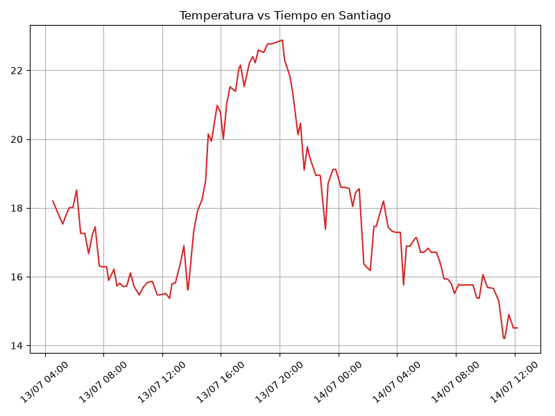
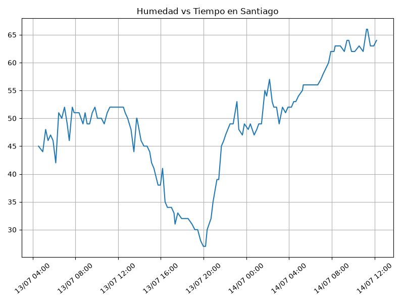
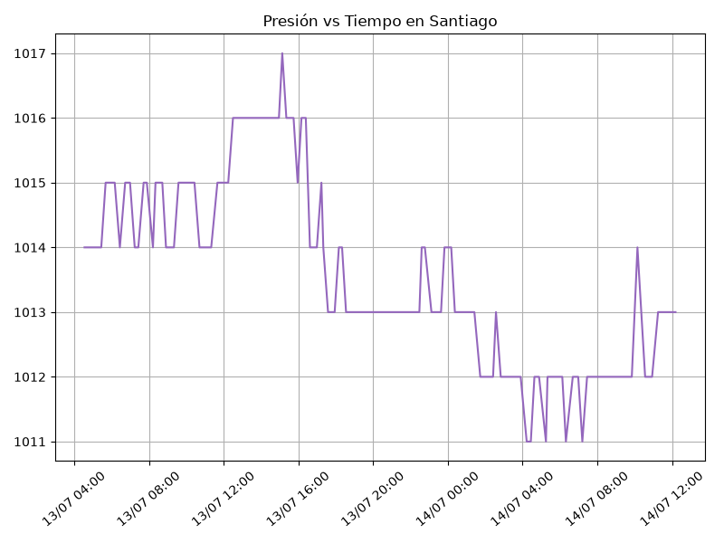
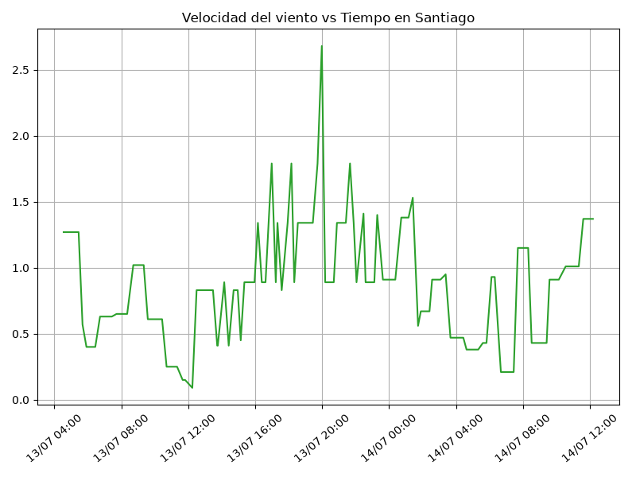

#+options: ':nil *:t -:t ::t <:t H:3 \n:nil ^:t arch:headline
#+options: author:t broken-links:nil c:nil creator:nil
#+options: d:(not "LOGBOOK") date:t e:t email:nil expand-links:t f:t
#+options: inline:t num:t p:nil pri:nil prop:nil stat:t tags:t
#+options: tasks:t tex:t timestamp:t title:t toc:t todo:t |:t
#+title: G1- Proyecto Final (ICCD332) Arquitectura de Computadores
#+date: 2026-07-13
#+author: Emilio Albán, Ariel Montufar, Karen Suarez, Samuel Churaco
#+email: emilio.alban@epn.edu.ec
#+language: es
#+select_tags: export
#+exclude_tags: noexport
#+creator: Emacs 27.1 (Org mode 9.7.5)
#+cite_export:
* *City Weather APP* - Registro Climatológico de Santiago (Chile)

** Descripción del Proyecto

El objetivo del proyecto consiste en desarrollar un sistema capaz de
consultar periódicamente el API de OpenWeatherMap para obtener
información climatológica de la ciudad de Santiago.

Los datos obtenidos son almacenados automáticamente en un archivo CSV
mediante un programa desarrollado en Python. La adquisición de
información se realiza cada 15 minutos utilizando Cron en Linux y
posteriormente los datos son representados mediante gráficas generadas
automáticamente y publicados mediante un sitio web generado con Emacs
Org Mode.

*** Tecnologías utilizadas
- Python 3
- OpenWeatherMap API
- Linux / WSL
- Cron
- Emacs Org Mode
- Pandas
- Matplotlib

** Estructura del proyecto
#+begin_src shell :results output :exports both
cd ..
cd ..
pwd
#+end_src

#+RESULTS:
: ~/G1ProyectoArq/ProyectoFinal-G1-Santiago

#+begin_src shell :results output :exports results
cd ..
cd ..
tree
#+end_src

#+RESULTS:
#+begin_example
.
├── CityTemperatureAnalysis.ipynb
├── clima-santiago-hoy.csv
├── generar_graficos.py
├── get-weather.sh
├── gptelIA.md
├── main.py
├── output.log
└── weather-site
    ├── build-site.el
    ├── build.sh
    ├── content
    │   ├── images
    │   ├── index.org
    │   ├── mult-ieee754.org
    │   └── robo_autopartes.org
    └── public
        ├── images
        └── index.html

6 directories, 15 files
#+end_example

*SOLUCIÓN:*

1. Consulta al API de OpenWeatherMap.
2. Procesamiento de la respuesta JSON.
3. Escritura de los datos en el archivo CSV.
4. Ejecución automática mediante get-weather.sh.
5. Programación periódica utilizando Cron.
6. Generación automática de gráficas.
7. Publicación del sitio web mediante Emacs.

** Formulación del Problema
Se realizó un registro climatológico de una ciudad
$Santiago, Chile$. Para esto, escriba un script de Python/Java que permita
obtener datos climatológicos desde el API de [[https://openweathermap.org/current#one][openweathermap]]. El API
hace uso de los valores de latitud $-33.45694$ y longitud $-70.64827$ de la ciudad
$Santiago$ para devolver los valores actuales cada 15 minutos.

Los resultados obtenidos de la consulta al API se escriben en un
archivo /clima-santiago-hoy.csv/. Cada ejecución del script se
almacena nuevos datos en el archivo. Se utilizó *crontab* para obtener datos del API de
/openweathermap/ con una periodicidad de 15 minutos mediante la
ejecución de un archivo ejecutable denominado
/get-weather.sh/. Todas las operaciones se realizaron en el
WSL.

** Descripción del código

El programa principal fue desarrollado en Python, donde
consulta el API de OpenWeatherMap para obtener información
climatológica de la ciudad de Santiago. Posteriormente, la respuesta
en formato JSON es procesada, normalizada y almacenada en un archivo
CSV, donde cada ejecución agrega un nuevo registro sin sobrescribir la
información existente.

*** Parámetros Iniciales
El programa inicia importando las librerías necesarias para realizar
la consulta al API, procesar la información obtenida y almacenarla en
un archivo CSV. Además, se definen constantes que serán utilizadas
durante toda la ejecución del programa.

#+begin_src python :session :results output exports both
import requests
import os
import csv
from datetime import datetime, UTC

# Variables de entorno.
# Fuente:
# https://docs.python.org/3/library/os.html
SANTIAGO_LAT = -33.45694
SANTIAGO_LONGITUDE = -70.64827
API_KEY = os.getenv("OPENWEATHER_API_KEY")
FILE_NAME = "clima-santiago-hoy.csv"
#+end_src

*** Lectura del API
Esta función realiza la conexión con el servicio web de OpenWeatherMap
mediante una petición HTTP GET. Para ello utiliza la latitud y
longitud de la ciudad de Santiago junto con la API KEY proporcionada
por el usuario. La respuesta del servidor es devuelta en formato JSON
para su posterior procesamiento.

#+begin_src python :session :results output exports both
def get_weather(lat, lon, api):
    # URL base del API
    url = "https://api.openweathermap.org/data/2.5/weather"

    # Parámetros enviados al API
    parametros = {
        "lat": lat,
        "lon": lon,
        "appid": api,
        "units": "metric",
        "lang": "es"
    }

    # Realiza la petición al servidor
    # Consulta HTTP utilizando Requests.
    # Fuente:
    # https://requests.readthedocs.io/en/latest/
    respuesta = requests.get(url, params=parametros)

    # Convierte la respuesta JSON en un diccionario de Python
    return respuesta.json()
#+end_src

*** Procesamiento de los datos
La información recibida desde el API es transformada en un diccionario
plano para facilitar su almacenamiento en el archivo CSV. Durante este
proceso se extraen las coordenadas, variables meteorológicas,
información del viento, nubosidad, datos del sistema y demás campos
disponibles en la respuesta del servicio.

#+begin_src python :session :results output exports both
def process(json):
    normalized_dict = {} # Diccionario donde se almacenarán todos los datos en formato plano
    # Fecha y hora de la medición
    # Conversión del timestamp UNIX.
    # Fuente:
    # https://docs.python.org/3/library/datetime.html
    normalized_dict["fecha_hora"] = datetime.fromtimestamp(
        json["dt"], UTC
    ).strftime("%Y-%m-%d %H:%M:%S")
    # COORDENADAS
    for clave, valor in json["coord"].items():
        normalized_dict["coord_" + clave] = valor
    # INFORMACIÓN PRINCIPAL DEL CLIMA
    for clave, valor in json["main"].items():
        normalized_dict["main_" + clave] = valor
    # VIENTO
    for clave, valor in json["wind"].items():
        normalized_dict["wind_" + clave] = valor
    # NUBES
    for clave, valor in json["clouds"].items():
        normalized_dict["clouds_" + clave] = valor
    # INFORMACIÓN DEL SISTEMA
    for clave, valor in json["sys"].items():
        normalized_dict["sys_" + clave] = valor
    # WEATHER ES UNA LISTA
    if len(json["weather"]) > 0:
        for clave, valor in json["weather"][0].items():
            normalized_dict["weather_" + clave] = valor
    # LLUVIA (puede no existir)
    if "rain" in json:
        for clave, valor in json["rain"].items():
            normalized_dict["rain_" + clave] = valor
    # NIEVE (puede no existir)
    if "snow" in json:
        for clave, valor in json["snow"].items():
            normalized_dict["snow_" + clave] = valor
    # CAMPOS SIMPLES DEL JSON
    normalized_dict["base"] = json["base"]
    normalized_dict["visibility"] = json["visibility"]
    normalized_dict["timezone"] = json["timezone"]
    normalized_dict["id"] = json["id"]
    normalized_dict["name"] = json["name"]
    normalized_dict["cod"] = json["cod"]
    # Retorna el diccionario listo para escribirlo en el CSV
    return normalized_dict
#+end_src

*** Escritura del archivo CSV
Los datos normalizados se almacenan en un archivo CSV utilizando la
librería csv de Python. Si el archivo aún no existe, se crea
automáticamente junto con su encabezado. En ejecuciones posteriores
únicamente se agrega una nueva fila con la información obtenida del
API.

#+begin_src python :session :results output exports both
def write2csv(weather, csv_filename):
    # Escritura del CSV.
    # Fuente:
    # https://docs.python.org/3/library/csv.html
    # Verifica si el archivo ya existe
    existe = os.path.isfile(csv_filename)
    # Abre el archivo en modo agregar
    with open(csv_filename, "a", newline="", encoding="utf-8") as archivo:
        # Crea el escritor utilizando las claves del diccionario
        writer = csv.DictWriter(
            archivo,
            fieldnames=weather.keys()
        )
        # Si el archivo es nuevo escribe el encabezado
        if not existe:
            writer.writeheader()
        # Escribe una nueva fila
        writer.writerow(weather)
#+end_src

*** Main()
Se coordina el flujo completo de ejecución: primero se consulta el API
de OpenWeatherMap, luego se verifica que la respuesta sea válida,
posteriormente se procesan los datos obtenidos y finalmente se
almacenan en el archivo CSV. Si ocurre algún error durante la
consulta, el programa informa que la ciudad no está disponible o que
la API KEY es inválida.
#+begin_src python :session :results output exports both
def main():
    print("===== Bienvenido a Santiago-Clima =====")

    santiago_weather = get_weather(
        lat=SANTIAGO_LAT,
        lon=SANTIAGO_LONGITUDE,
        api=API_KEY
    )

    if santiago_weather["cod"] == 200:
        weather = process(santiago_weather)
        write2csv(weather, FILE_NAME)
        print("Datos guardados correctamente.")
    else:
        print("Ciudad no disponible o API KEY no válida")

if __name__ == "__main__":
    main()
#+end_src

** Script ejecutable sh
se desarrolló un script denominado $get-weather.sh$. Este archivo activa
el entorno de trabajo *iccd332*, accede al directorio del proyecto y
ejecuta el programa principal en Python. Toda la salida
generada durante la ejecución se almacena en el archivo $output.log$
para facilitar la verificación del funcionamiento del sistema.

#+begin_src shell :results output :exports both
#!/bin/bash
# Activar Conda
source /home/emilioalbanfs/miniforge3/etc/profile.d/conda.sh
eval "$(conda shell.bash hook)"
conda activate iccd332
# Ir al directorio del proyecto
cd "$(dirname "$0")"
export OPENWEATHER_API_KEY="..."
python3 main.py >> output.log 2>&1
#+end_src

** Configuración de Crontab
Para automatizar la adquisición de datos climatológicos se utilizó el
servicio Cron de Linux. Se configuró una tarea programada que ejecuta
el script get-weather.sh cada quince minutos, permitiendo obtener
nuevos registros de manera periódica sin intervención del usuario. De
esta forma se construye automáticamente el historial climatológico
almacenado en el archivo CSV.

#+begin_src shell
*/15 * * * * $HOME/G1ProyectoArq/ProyectoFinal-G1-Santiago/get-weather.sh >> $HOME/G1ProyectoArq/ProyectoFinal-G1-Santiago/output.log 2>&1
#+end_src

* Presentación de resultados
Para la presentación de resultados se utilizan las librerías de Python:
- matplotlib
- pandas

** Resultados
En esta sección se presentan los resultados obtenidos durante la
ejecución del sistema de adquisición de datos. A partir de la
información almacenada en el archivo CSV se muestran ejemplos de los
registros recopilados y diversas gráficas que permiten visualizar el
comportamiento de las principales variables meteorológicas de la
ciudad de Santiago.

** Muestra De datos
Se presenta una muestra de los registros almacenados en el archivo
clima-santiago-hoy.csv. Cada fila corresponde a una consulta realizada
al API de OpenWeatherMap e incluye información sobre la fecha y hora
de la medición, temperatura, humedad, presión atmosférica, velocidad
del viento y demás variables obtenidas durante la consulta.
ó
Presentar una muestra de 10 valores aleatorios de los datos obtenidos.

# ANRRESSSS 1

#+caption: Lectura de archivo csv
#+begin_src python :session :results output exports both
import pandas as pd
import matplotlib.pyplot as plt
import matplotlib.dates as mdates

# Leer el archivo CSV
df = pd.read_csv("clima-santiago-hoy.csv")
# Convertir la columna de fecha a datetime
df["fecha_hora"] = pd.to_datetime(df["fecha_hora"])
# se imprime la estructura del dataframe en forma de filas x columnas
print(df.shape)
#+end_src

Resultado del número de filas y columnas leídos del archivo csv
#+RESULTS:
: (57, 30)

# ANRRESSSS 2

#+caption: Despliegue de datos aleatorios
#+begin_src python :session :exports both :results value table :return table
table1 = df.sample(10)
table = [list(table1)]+[None]+table1.values.tolist()
#+end_src

#+RESULTS:
| dt                  | coord_lon | coord_lat | weather_0_id | weather_0_main | weather_0_description | weather_0_icon | base     | main_temp | main_feels_like | main_temp_min | main_temp_max | main_pressure | main_humidity | main_sea_level | main_grnd_level | visibility | wind_speed | wind_deg | wind_gust | clouds_all | sys_type | sys_id | sys_country | sys_sunrise         | sys_sunset          | timezone |      id | name  | cod |
|---------------------+-----------+-----------+--------------+----------------+-----------------------+----------------+----------+-----------+-----------------+---------------+---------------+---------------+---------------+----------------+-----------------+------------+------------+----------+-----------+------------+----------+--------+-------------+---------------------+---------------------+----------+---------+-------+-----|
| 2024-08-03 21:57:57 |  -78.5249 |   -0.2299 |          804 | Clouds         | overcast clouds       | 04n            | stations |      8.53 |            8.53 |          8.53 |          8.53 |          1019 |            90 |           1019 |             724 |      10000 |       0.78 |       75 |      1.58 |         97 |        1 |   8555 | EC          | 2024-08-03 06:17:01 | 2024-08-03 18:23:24 |   -18000 | 3652462 | Quito | 200 |
| 2024-08-04 10:26:16 |   -78.525 |   -0.2299 |          804 | Clouds         | overcast clouds       | 04d            | stations |     16.53 |           15.57 |         16.53 |         16.53 |          1016 |            51 |           1016 |             728 |      10000 |       1.11 |        6 |       2.1 |         90 |        1 |   8555 | EC          | 2024-08-04 06:16:56 | 2024-08-04 18:23:19 |   -18000 | 3652462 | Quito | 200 |
| 2024-08-04 09:15:02 |  -78.5249 |   -0.2299 |          804 | Clouds         | overcast clouds       | 04d            | stations |     14.53 |           13.61 |         14.53 |         14.53 |          1018 |            60 |           1018 |             726 |      10000 |       0.73 |       90 |      1.81 |         86 |        1 |   8555 | EC          | 2024-08-04 06:16:56 | 2024-08-04 18:23:19 |   -18000 | 3652462 | Quito | 200 |
| 2024-08-06 10:05:50 |  -78.5211 |   -0.2309 |          801 | Clouds         | few clouds            | 02d            | stations |     14.66 |           13.59 |         14.66 |         14.66 |          1017 |            54 |           1017 |             730 |      10000 |       1.01 |       25 |      1.74 |         15 |        1 |   8555 | EC          | 2024-08-06 06:16:44 | 2024-08-06 18:23:07 |   -18000 | 3652462 | Quito | 200 |
| 2024-08-03 02:43:26 |  -78.5249 |   -0.2299 |          802 | Clouds         | scattered clouds      | 03n            | stations |      7.53 |            6.77 |          7.53 |          7.53 |          1019 |            81 |           1019 |             722 |      10000 |       1.55 |      171 |      1.97 |         44 |        1 |   8555 | EC          | 2024-08-03 06:17:01 | 2024-08-03 18:23:24 |   -18000 | 3652462 | Quito | 200 |
| 2024-08-04 22:50:26 |  -78.5249 |   -0.2299 |          802 | Clouds         | scattered clouds      | 03n            | stations |      9.53 |            9.53 |          9.53 |          9.53 |          1020 |            93 |           1020 |             724 |      10000 |       1.18 |      117 |       1.4 |         38 |        1 |   8555 | EC          | 2024-08-04 06:16:56 | 2024-08-04 18:23:19 |   -18000 | 3652462 | Quito | 200 |
| 2024-08-03 12:52:29 |  -78.5211 |   -0.2309 |          801 | Clouds         | few clouds            | 02d            | stations |     20.66 |           19.72 |         20.66 |         20.66 |          1012 |            36 |           1012 |             729 |      10000 |       4.05 |      341 |       5.7 |         17 |        1 |   8555 | EC          | 2024-08-03 06:17:00 | 2024-08-03 18:23:23 |   -18000 | 3652462 | Quito | 200 |
| 2024-08-03 10:54:26 |  -78.5211 |   -0.2309 |          800 | Clear          | clear sky             | 01d            | stations |     15.66 |           14.12 |         15.66 |         15.66 |          1015 |            32 |           1015 |             730 |      10000 |       2.42 |      354 |       3.3 |         10 |        1 |   8555 | EC          | 2024-08-03 06:17:00 | 2024-08-03 18:23:23 |   -18000 | 3652462 | Quito | 200 |
| 2024-08-02 23:51:42 |  -78.5211 |   -0.2309 |          803 | Clouds         | broken clouds         | 04n            | stations |      8.66 |            8.66 |          8.66 |          8.66 |          1020 |            88 |           1020 |             726 |       8882 |       1.17 |      146 |      1.32 |         68 |        1 |   8555 | EC          | 2024-08-02 06:17:04 | 2024-08-02 18:23:27 |   -18000 | 3652462 | Quito | 200 |
| 2024-08-03 02:13:58 |  -78.5249 |   -0.2299 |          802 | Clouds         | scattered clouds      | 03n            | stations |      7.53 |            6.77 |          7.53 |          7.53 |          1019 |            85 |           1019 |             722 |      10000 |       1.55 |      160 |      1.87 |         26 |        1 |   8555 | EC          | 2024-08-03 06:17:01 | 2024-08-03 18:23:24 |   -18000 | 3652462 | Quito | 200 |

** Gráfica Temperatura vs Tiempo
La siguiente gráfica muestra la evolución de la temperatura registrada
en Santiago a lo largo del período de adquisición de datos. Cada punto
representa una consulta realizada automáticamente mediante Cron.

El siguiente cógido permite hacer la gráfica de la temperatura vs
tiempo para Org 9.7+.

#+begin_src python :results file :exports both :session
import matplotlib.pyplot as plt
import matplotlib.dates as mdates
# Crear la figura
fig = plt.figure(figsize=(8,6))
# TEMPERATURA VS TIEMPO
plt.plot(df["fecha_hora"], df["main_temp"])
# Ajuste de las fechas
plt.gca().xaxis.set_major_locator(mdates.AutoDateLocator())
plt.gca().xaxis.set_major_formatter(mdates.DateFormatter("%d/%m %H:%M"))
# Cuadrícula
plt.grid()
# Título
plt.title(f"Temperatura vs Tiempo en {next(iter(set(df['name'])))}")
# Rotar etiquetas
plt.xticks(rotation=40)
# Ajustar márgenes
fig.tight_layout()
# Guardar imagen
fname = "./weather-site/content/images/temperatura.png"
plt.savefig(fname)
#+end_src

#+caption: Gráfica Temperatura vs Tiempo
#+RESULTS:

** Gráfica Humedad vs Tiempo
#+begin_src python :results file :exports both :session
# HUMEDAD VS TIEMPO
plt.plot(df["fecha_hora"], df["main_humidity"])
plt.title(f"Humedad vs Tiempo en {next(iter(set(df['name'])))}")
fname = "./weather-site/content/images/humedad.png"
#+end_src

#+caption: Gráfica Humedad vs Tiempo
#+RESULTS:

** Gráfica Presión vs Tiempo
#+begin_src python :results file :exports both :session
# PRESION VS TIEMPO
plt.plot(df["fecha_hora"], df["main_pressure"])
plt.title(f"Presión vs Tiempo en {next(iter(set(df['name'])))}")
fname = "./weather-site/content/images/presion.png"
#+end_src

#+caption: Gráfica Presión vs Tiempo
#+RESULTS:

** Gráfica Velocidad del Viento vs Tiempo
#+begin_src python :results file :exports both :session
# VELOCIDAD DEL VIENTO VS TIEMPO
plt.plot(df["fecha_hora"], df["wind_speed"])
plt.title(f"Velocidad del viento vs Tiempo en {next(iter(set(df['name'])))}")
fname = "./weather-site/content/images/viento.png"
#+end_src

#+caption: Gráfica Velocidad del viento vs Tiempo
#+RESULTS:

Debido a que el archivo index.org se abre dentro de la carpeta
/content/, y en cambio el servidor http de emacs se ejecuta desde la
carpeta /public/ es necesario copiar el archivo a la ubicación
equivalente en ~/public/images~

#+begin_src shell
cp -rfv ./images/* /home/emilioalbanfs/G1ProyectoArq/ProyectoFinal-G1-Santiago/weather-site/public/images
#+end_src

#+RESULTS:
| './images/humedad.png'     | -> | '/home/emilioalbanfs/G1ProyectoArq/ProyectoFinal-G1-Santiago/weather-site/public/images/humedad.png'     |
| './images/presion.png'     | -> | '/home/emilioalbanfs/G1ProyectoArq/ProyectoFinal-G1-Santiago/weather-site/public/images/presion.png'     |
| './images/temperatura.png' | -> | '/home/emilioalbanfs/G1ProyectoArq/ProyectoFinal-G1-Santiago/weather-site/public/images/temperatura.png' |
| './images/viento.png'      | -> | '/home/emilioalbanfs/G1ProyectoArq/ProyectoFinal-G1-Santiago/weather-site/public/images/viento.png'      |

* Instrucciones Java Script
En la siguiente página se indica cómo integrar ~javascript~ como un
alternativa para testear el código.
[[file:index.org][
JavaScript]]

* Referencias
** OpenWeatherMap
- [[https://openweathermap.org/api][Obtención del API]]
- [[https://openweathermap.org/current][Consulta del Clima]]
- [[https://openweathermap.org/current#parameter][Formato de Respuesta JSON]]
** Python
- [[https://requests.readthedocs.io/en/latest/][Requests]]
- [[https://docs.python.org/3/library/csv.html][Libreria CSV]]
- [[https://docs.python.org/3/library/datetime.html][Libreria DATETIME]]
- [[https://docs.python.org/3/library/os.html][Libreria OS]]
** Pandas
- [[https://pandas.pydata.org/docs/][Pandas]]
** Matplotlib
- [[https://matplotlib.org/stable/][Matplot lib documentation]]
- [[https://matplotlib.org/stable/api/dates_api.html][Dates_Api]]
** Emacs
- [[https://orgmode.org/][Emacs Org Mode]]
** HTTPD
- [[https://github.com/skeeto/emacs-web-server][Simple-Httpd]]
- [[https://www.youtube.com/watch?v=AfkrzFodoNw][Vídeo Youtube Build Your Website with Org Mode]

