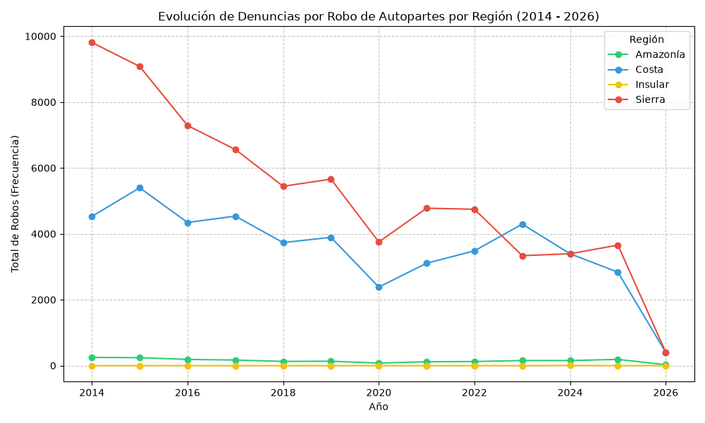

#+TITLE: Cifras de Seguridad: Robo de Autopartes
#+AUTHOR: Ariel Montufar
#+OPTIONS: toc:2 num:nil

** ¿Qué parámetros se utilizaron para el procesamiento de datos?
Para el procesamiento de datos se extrajeron los datos de cifras de seguridad del INEC, específicamente la sección de robos de auto-partes desde el año 2014 hasta el 2026.
Se filtraron los datos en base a las regiones: costa, sierra, amazonía e insular.

#+BEGIN_SRC python :results output :python /home/arielmontufar/miniforge3/bin/python
import pandas as pd
import matplotlib.pyplot as plt

df_robo = pd.read_excel('022026_Tabulados Seguridad.xlsx', sheet_name='7.robo_autopartes', header=3)
df_robo = df_robo.rename(columns={'Provincia de ocurrencia': 'Provincia'})
df_robo = df_robo.dropna(subset=['Provincia'])

df_robo['Provincia'] = df_robo['Provincia'].str.strip().str.title()

regiones = {
    'Azuay': 'Sierra', 'Bolívar': 'Sierra', 'Cañar': 'Sierra', 'Carchi': 'Sierra',
    'Cotopaxi': 'Sierra', 'Chimborazo': 'Sierra', 'Imbabura': 'Sierra', 'Loja': 'Sierra',
    'Pichincha': 'Sierra', 'Tungurahua': 'Sierra',
    'El Oro': 'Costa', 'Esmeraldas': 'Costa', 'Guayas': 'Costa', 'Los Ríos': 'Costa',
    'Manabí': 'Costa', 'Santo Domingo De Los Tsáchilas': 'Costa', 'Santa Elena': 'Costa',
    'Morona Santiago': 'Amazonía', 'Napo': 'Amazonía', 'Pastaza': 'Amazonía',
    'Zamora Chinchipe': 'Amazonía', 'Sucumbíos': 'Amazonía', 'Orellana': 'Amazonía',
    'Galápagos': 'Insular'
}
df_robo['Región'] = df_robo['Provincia'].map(regiones)

df_robo = df_robo.dropna(subset=['Región']) 

date_cols = df_robo.columns[4:-1]

df_long = df_robo[['Provincia', 'Región'] + list(date_cols)].melt(id_vars=['Provincia', 'Región'], var_name='Fecha', value_name='Robos')

df_long['Robos'] = pd.to_numeric(df_long['Robos'], errors='coerce').fillna(0)
df_long['Anio'] = pd.to_datetime(df_long['Fecha']).dt.year

df_grouped = df_long.groupby(['Región', 'Anio'])['Robos'].sum().reset_index()

df_pivot = df_grouped.pivot(index='Anio', columns='Región', values='Robos').fillna(0).astype(int)

df_pivot['Total Nacional'] = df_pivot.sum(axis=1)

print("\n--- Tabla de Robos de Autopartes por Año y Región ---")
print(df_pivot.to_string())

plt.figure(figsize=(10, 6))

colores = {'Sierra': '#e74c3c', 'Costa': '#3498db', 'Amazonía': '#2ecc71', 'Insular': '#f1c40f'}

for region in df_grouped['Región'].unique():
    datos_region = df_grouped[df_grouped['Región'] == region]
    plt.plot(datos_region['Anio'], datos_region['Robos'], marker='o', label=region, color=colores.get(region, 'black'))

plt.title('Evolución de Denuncias por Robo de Autopartes por Región (2014 - 2026)')
plt.xlabel('Año')
plt.ylabel('Total de Robos (Frecuencia)')
plt.grid(True, linestyle='--', alpha=0.7)
plt.legend(title='Región')
plt.tight_layout()

plt.savefig("./weather-site/content/images/robo_autopartes_evolucion.png")
print('Gráfico guardado exitosamente como robo_autopartes_evolucion.png')
#+END_SRC

#+RESULTS:
#+begin_example

--- Tabla de Robos de Autopartes por Año y Región ---
Región  Amazonía  Costa  Insular  Sierra  Total Nacional
Anio                                                    
2014         249   4527        0    9808           14584
2015         240   5398        0    9081           14719
2016         187   4345        0    7288           11820
2017         169   4537        0    6561           11267
2018         127   3734        0    5444            9305
2019         133   3893        1    5659            9686
2020          76   2384        0    3754            6214
2021         116   3107        0    4777            8000
2022         124   3484        0    4746            8354
2023         154   4294        1    3337            7786
2024         154   3394        4    3396            6948
2025         188   2836        1    3656            6681
2026          28    400        0     408             836
#+end_example

** ¿Gráfico?
En el siguiente gráfico se puede observar una comparación de las estadísticas del robo de auto-partes durante el periodo 2014-2026 en las distintas regiones del país .

